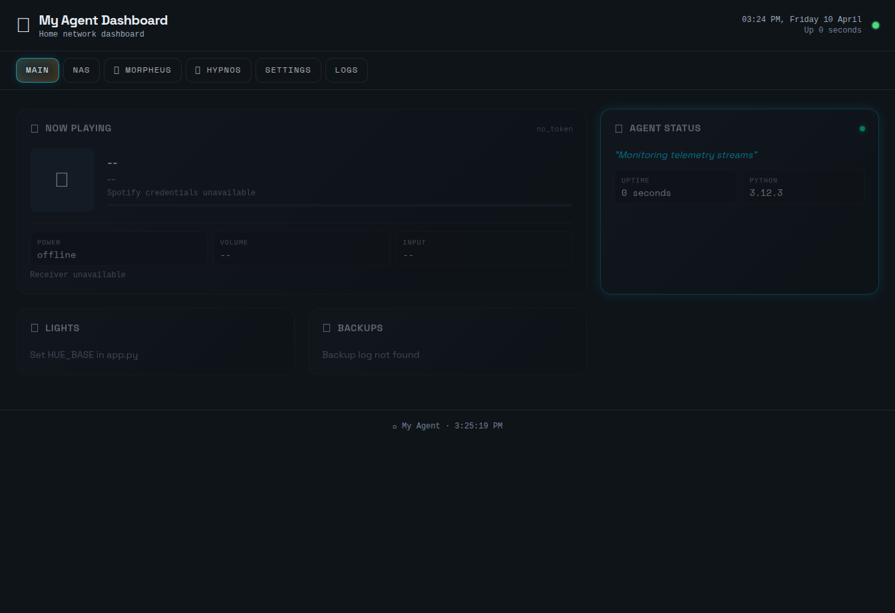

# 🪸 OpenClaw Dashboard

Clone it, edit the variables at the top of `app.py`, run it.

  



## Quick start

```bash
git clone https://github.com/cknzraposo/openclaw-dashboard.git
cd openclaw-dashboard
pip install -r requirements.txt
python app.py
```

Open `http://localhost:8080`.

## Configure it

1. Copy `.env.example` to `.env` and add secrets.
2. Open `app.py` and edit the top variables (agent name, host IPs, NAS paths, log files, etc).

No `config.yaml`; no theme switching; no build step.

## Panels and integrations

- **Now Playing**: Spotify Web API + Yamaha MusicCast receiver
- **Hue Lights**: Philips Hue Bridge API
- **Backups**: backup freshness from your backup log file
- **Ollama Models**: Ollama API (`/api/tags`, `/api/ps`)
- **Entertainment**: NAS media + NAS storage over SSH
- **System Health**: local/remote host CPU/RAM/disk/tools
- **Cron**: local/remote crontab listing
- **Logs**: tail local log files

## Notes

- SSE architecture is used for live updates (`/events`).
- Missing or unconfigured services fail gracefully and show as offline/unavailable.
- Default port is `8080`.

## License

[MIT](LICENSE)
